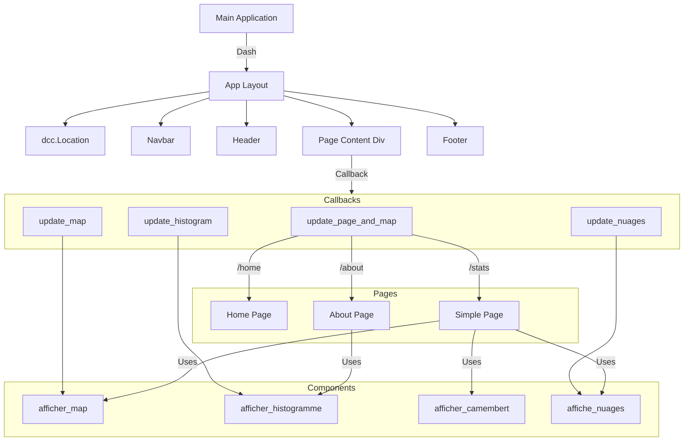

# README
## _Tempêtes et Santé Publique_

## User Guide

Pour déployer et utiliser le dashboard il faut lancer cette commande dans le terminal :

```sh
python main.py
```

## Data

Nous avons utilisé des données provenant de l'[EM-DAT](https://www.emdat.be/) qui contient une base de données sur les catastrophes dans le monde entier. Les données ont été diffusées par le Centre de recherche sur l'épidémiologie des catastrophes (CRED). Cependant les données ne pouvaient pas être téléchargé à partir de notre programme car une connexion à un compte était nécessaire. Nous avons donc téléchargé les données manuellement, puis les avons intégrées dans un dépôt Git afin de pouvoir les télécharger directement lors de l'exécution du programme (sous l'accord de Monsieur PERRET).


## Developer Guide
Voici le diagramme de l'architecture de notre application réalisé avec Mermaid :


Notre programme est de type impératif, le code est structuré en fonctions appelées depuis le programme principal.


## Rapport d'analyse
met en avant les principales conclusions extraites des données


## Copyright

Nous déclarons sur l'honneur que le code fourni a été produit par nous même, à l'exception des lignes ci-dessous : 
 
Pour les components 2 et 3 nous avons repris quelques morceaux de code de ces sites pour faire les figures :
https://moncoachdata.com/tutos/diagrammes-de-base-avec-plotly/
https://plotly.com/python-api-reference/generated/plotly.graph_objects.Figure.html

Pour remplacer les guillemets dans nos data et remplacer les noms des pays qui n'étaient pas pareil que le JSON :
https://stackoverflow.com/questions/41403301/replace-values-in-dataframe-python
Nous avons utilisé chatgpt pour comprendre le problème d'incompatibilité entre les noms des pays du CSV et du JSON pour afficher les données sur la map car il nous manquait beaucoup de pays sur l'affichage de la map. Nous n'avons pas copié le code.

Pour la ligne sur le subprocess dans le main : https://docs.python.org/3/library/subprocess.html#subprocess.check_call
https://www.digitalocean.com/community/tutorials/how-to-use-subprocess-to-run-external-programs-in-python-3-fr

Pour le style de nos pages nous nous sommes inspirées de ces morceaux de codes : https://medium.com/plotly/how-to-create-a-beautiful-interactive-dashboard-layout-in-python-with-plotly-dash-a45c57bb2f3c

Le reste du code à été inspiré par le cours.
