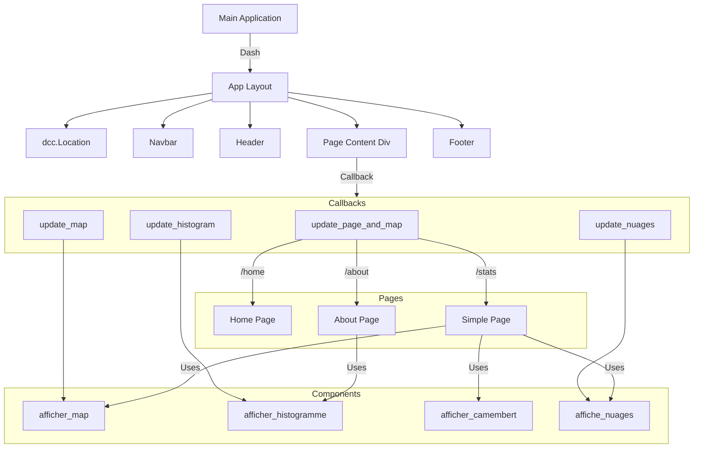

# README
## _Tempêtes et Santé Publique_

## User Guide

Pour déployer et utiliser le dashboard il faut lancer cette commande dans le terminal :

```sh
python main.py
```

## Data

Nous avons utilisé des données provenant de l'[EM-DAT](https://www.emdat.be/) qui contient une base de données sur les catastrophes dans le monde entier. Les données ont été diffusées par le Centre de recherche sur l'épidémiologie des catastrophes (CRED). Cependant les données ne pouvaient pas être téléchargé à partir de notre programme car une connexion à un compte était nécessaire. Nous avons donc téléchargé les données manuellement, puis les avons intégrées dans un dépôt Git afin de pouvoir les télécharger directement lors de l'exécution du programme (sous l'accord de Monsieur PERRET).


## Developer Guide
Voici le diagramme de l'architecture de notre application réalisé avec Mermaid :


Notre programme est de type impératif, le code est structuré en fonctions appelées depuis le programme principal.


## Rapport d'analyse
Ce rapport présente une analyse des tempêtes mondiales à partir d'un ensemble de données collectées sur plusieurs années. Les données traitées couvrent divers aspects des tempêtes, tels que le nombre de tempêtes, leur impact (dégâts et nombre de personnes affectées), ainsi que l'aide internationale reçue par les pays touchés. Le rapport est basé sur différentes visualisations, notamment un histogramme, une carte géographique, un graphique en camembert, et un nuage de points (scatter plot).

Pour l'histogramme, nous remarquons que de 2000 à 2023 la chine est le pays qui a eu le plus de tempetes, suivie des philippines, indonesie et usa.
Pour la carte géographique, les pays ayant le plus de nombre de personnes affecté (mort,blessé) sont situé en chine inde et philippine donc à l'est.
Pour les degats totaux la chine le japon et les etats unis 
Pour le graphique en camembert, nous remarquons que le type de tempetes le plus frequants est hydrologique ou geophysique (expliquer) mais tres peu meteoroliguqe
Pour finir avec le nuage de points, nous remarquons que les pays ayant le plus d'aide lors d'une tempete sont ceux qui ont bcp de degat, le flood faisant le plus de mort et le earthtaque le plus de degat 

 1. Histogramme : Nombre de Tempêtes par Pays (2000-2023)

L'histogramme révèle que, sur la période de 2000 à 2023, la **Chine** est le pays ayant enregistré le plus grand nombre de tempêtes, suivie par des pays comme les **Philippines**, l'**Indonésie**, et les **États-Unis**. Ces pays sont régulièrement confrontés à des phénomènes météorologiques extrêmes, principalement en raison de leur situation géographique et de leur vulnérabilité aux tempêtes.

 2. Carte Géographique : Nombre de Personnes Affectées (Morts, Blessés)

La carte montre que les pays les plus affectés par les tempêtes en termes de pertes humaines (morts, blessés) sont principalement situés en **Asie de l'Est**, notamment la **Chine**, l'**Inde**, et les **Philippines**. Ces régions, en particulier les îles comme les Philippines, sont régulièrement exposées à des tempêtes puissantes qui causent des dégâts humains considérables. La densité de population dans ces pays amplifie l'impact humain de ces catastrophes naturelles.

 3. Dégâts Totaux : Pays les Plus Touchés

Les dégâts économiques causés par les tempêtes sont particulièrement élevés dans des pays comme la **Chine**, le **Japon** et les **États-Unis**. Ces pays subissent des dommages matériels massifs en raison de la fréquence et de la violence des tempêtes qui les frappent, notamment des typhons, des cyclones, et des ouragans. En raison de leur position géographique et de leur taille, ces pays sont à la fois des zones de forte activité cyclonique et des zones économiques de grande importance, ce qui amplifie les conséquences économiques des catastrophes.

 4. Graphique en Camembert : Types de Tempêtes

Le graphique en camembert montre que les **tempêtes hydrologiques** et **géophysiques** sont les plus fréquentes. Ces deux types de tempêtes comprennent :

- **Les tempêtes hydrologiques** : Ce type de tempête est principalement lié aux **inondations**, souvent causées par des pluies torrentielles ou des typhons. Les inondations provoquent des dégâts considérables, notamment dans les zones urbaines à forte densité de population.
- **Les tempêtes géophysiques** : Ce groupe inclut les événements comme les **tremblements de terre** et les **tsunamis**. Bien que moins fréquentes que les tempêtes hydrologiques, elles sont souvent plus dévastatrices en termes de dégâts matériels et de pertes humaines.

À l'opposé, les **tempêtes météorologiques** (principalement les cyclones et les ouragans) sont moins fréquentes, mais elles peuvent être particulièrement violentes lorsqu'elles se produisent.

 5. Nuage de Points : Impact Humain vs Aide Internationale

Le nuage de points met en évidence une corrélation entre les **dégâts matériels** et l'**aide internationale**. Les pays qui subissent les plus grandes pertes matérielles (comme la **Chine** et les **États-Unis**) reçoivent proportionnellement plus d'aide internationale. En revanche, les pays avec moins de dégâts matériels mais un nombre élevé de victimes humaines, comme les **Philippines**, reçoivent parfois moins de soutien, bien que leur besoin d'aide humanitaire soit tout aussi pressant.

En ce qui concerne les types de tempêtes, les **inondations** sont celles qui provoquent le plus de pertes humaines, tandis que les **tremblements de terre** génèrent les plus grands dégâts matériels, en raison de leur capacité à détruire des infrastructures massives en un court laps de temps.

Conclusion : Impact des Tempêtes et Réchauffement Climatique
Ainsi, les données montrent que les tempêtes ont des effets dévastateurs sur les populations et les économies, en particulier dans les régions vulnérables d'Asie de l'Est. Cependant, il est important de noter que, bien que la fréquence des tempêtes semble stable ou variable dans certaines régions, le réchauffement climatique pourrait jouer un rôle important dans l'intensification de ces phénomènes. 

## Copyright

Nous déclarons sur l'honneur que le code fourni a été produit par nous même, à l'exception des lignes ci-dessous : 
 
Pour les components 2 et 3 nous avons repris quelques morceaux de code de ces sites pour faire les figures :
https://moncoachdata.com/tutos/diagrammes-de-base-avec-plotly/
https://plotly.com/python-api-reference/generated/plotly.graph_objects.Figure.html

Pour remplacer les guillemets dans nos data et remplacer les noms des pays qui n'étaient pas pareil que le JSON :
https://stackoverflow.com/questions/41403301/replace-values-in-dataframe-python
Nous avons utilisé chatgpt pour comprendre le problème d'incompatibilité entre les noms des pays du CSV et du JSON pour afficher les données sur la map car il nous manquait beaucoup de pays sur l'affichage de la map. Nous n'avons pas copié le code.

Pour la ligne sur le subprocess dans le main : https://docs.python.org/3/library/subprocess.html#subprocess.check_call
https://www.digitalocean.com/community/tutorials/how-to-use-subprocess-to-run-external-programs-in-python-3-fr

Pour le style de nos pages nous nous sommes inspirées de ces morceaux de codes : https://medium.com/plotly/how-to-create-a-beautiful-interactive-dashboard-layout-in-python-with-plotly-dash-a45c57bb2f3c

Le reste du code à été inspiré par le cours.
