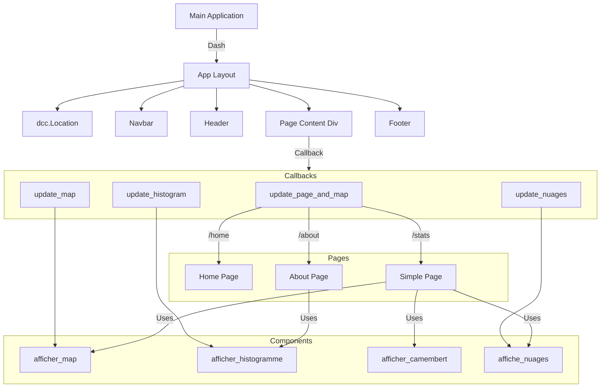

# README
## _Tempêtes et Santé Publique_

## User Guide

Pour déployer et utiliser le dashboard il faut lancer cette commande dans le terminal:

```sh
python main.py
```

## Data

Nous avons utilisé des données provenant de l'[EM-DAT](https://www.emdat.be/) qui contient une base de données sur les catastrophes dans le monde entier. Les données ont été diffusées par le Centre de recherche sur l'épidémiologie des catastrophes (CRED). Cependant les données ne pouvaient pas être téléchargé à partir de notre programme car il fallait se connecter à un compte. Nous avons donc télécharger les données puis mis dans un git pour pouvoir les télécharger à partir de cet endroit lorque l'on lance le programme (sous l'accord de Monsieur PERRET).


## Developer Guide
faire graphique architecture

## Rapport d'analyse
met en avant les principales conclusions extraites des données


## Copyright

Nous déclarons sur l'honneur que le code fourni a été produit par nous même, à l'exception des lignes ci-dessous : 
